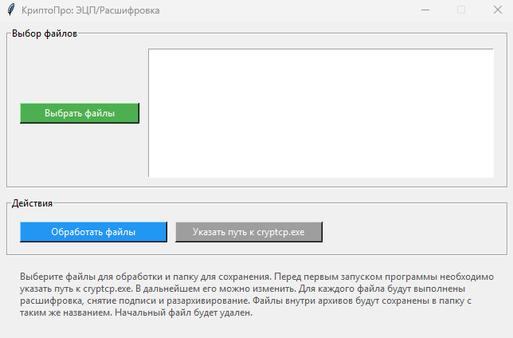

# CryptoProGUI

Инструмент для автоматической обработки файлов с **ЭЦП, шифрованием и архивами**, написанный на Python.  
Программа умеет последовательно выполнять действия над файлами, двигаясь от последнего расширения к исходному:

- 📦 Распаковка ZIP-архивов (включая вложенные архивы)  
- 🔐 Расшифровка файлов (.enc) через КриптоПро 
- ✍️ Проверка и снятие подписи (.sig)  
- 📂 Сохранение итоговых файлов в заданную директорию, при этом файлы внутри архивов раскладываются по папкам с названием архива  
- 🧹 Автоматическое удаление промежуточных файлов  

---

## Интерфейс

Простое графическое приложение на **Tkinter**:  
- выбор файлов для обработки  
- настройка пути к `cryptcp.exe` (сохраняется в конфиг)  
- запуск обработки в один клик  
- логирование всех действий  

---

## Технологии

- **Python 3.9+**
- **Tkinter** — GUI  
- **subprocess** — вызовы КриптоПро (`cryptcp.exe`)  
- **zipfile / shutil / os** — работа с архивами и файловой системой  
- **json** — хранение настроек  
- **logging (собственная реализация)** — сохранение истории работы  

---

## Установка и запуск

**1. Склонируйте репозиторий или скачайте архив:**
```bash
git clone https://github.com/your-username/crypto-files-gui.git](https://github.com/gnomegenome9/CryptoProGUI.git
cd CryptoProGUI
```

**2. Установите зависимости (только стандартные модули Python, доп. пакеты не требуются).**
Убедитесь, что установлен **Python 3.9+**

**3. Скачайте и установите CryptoPro CSP**, если он ещё не установлен.

**4. Скачайте** `cryptcp.exe` с официального [сайта КриптоПро] (https://cryptopro.ru/products/csp/downloads)(идёт вместе с CryptoPro CSP) и укажите путь к нему при первом запуске программы.

**5. Запустите приложение:**
```bash
python main.py
```

**6.** (Опционально) **Соберите .exe для Windows** с помощью [PyInstaller] (https://pyinstaller.org/en/stable/):
```bash
python -m PyInstaller --onefile --windowed --name "CryptoGUI" main.py
```

После этого готовый `.exe` появится в папке `dist/.`

### Интерфейс приложения  


